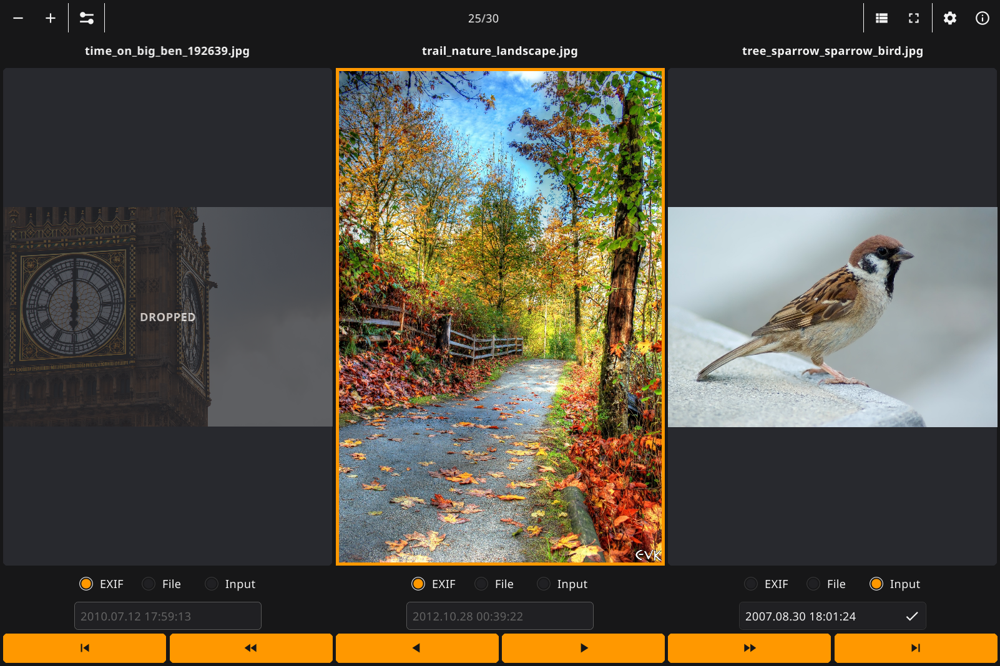

### Use Pixyne to quickly review your photo folders, safely delete bad and similar shots, fix the shooting dates, crop and ajust photos    

---

Pixyne is an application that allows you to quickly review your photo folders, safely delete bad and similar shots, fix the shooting dates, crop and ajust photos.

## How to use

Pixyne application has a simple and intuitive interface:   
* With a click on photo you can mark to drop it in the trash.
* In Advanced mode you may also set or correct the EXIF shooting date crop the size and ajust selected photo.
* When you save changes, you can change all file names to EXIF shooting date format.  
* In a list view, clicking on a row number button opens the corresponding photo.  
* Changes will not be applied until you save. Pixyne automaticaly stores the current state of the folder so you can undo changes at any time. This is useful when working with a large number of photos and you need to close the application in order to continue working later.   
* If you open another folder, all unsaved changes will be lost but not photos
* On save originals of modified and dropped photos will be copied to "backup" subfolder.
* You can control the application using the keyboard.   

Detailed instructions on how to install and use Pixyne can be found on the [product website.](https://vinser.github.io/pixyne/)

Enjoy!  
